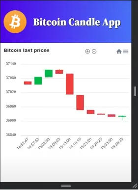

# Bitcoin_RabbitMQ-node

<h2>Aplicação Web utilizando vue.js para consumir API com back-end em node/express e retornar cotação de bitcoin e dolar graficamente utilizando vue-charts.js &#128202</h2>

<h3>Tecnologias &#127760</h3>
<ul>
  <li>Vue.js</li>
  <li>Node.js/Express.js</li>
  <li>MongoDB/mongoose</li>
  <li>Docker</li>
  <li>Charts</li>
  <li>RabbitMQ</li>
  <li>Git</li>
</ul>

